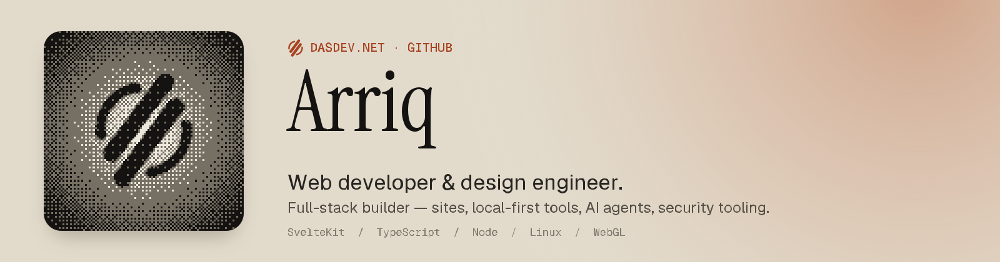
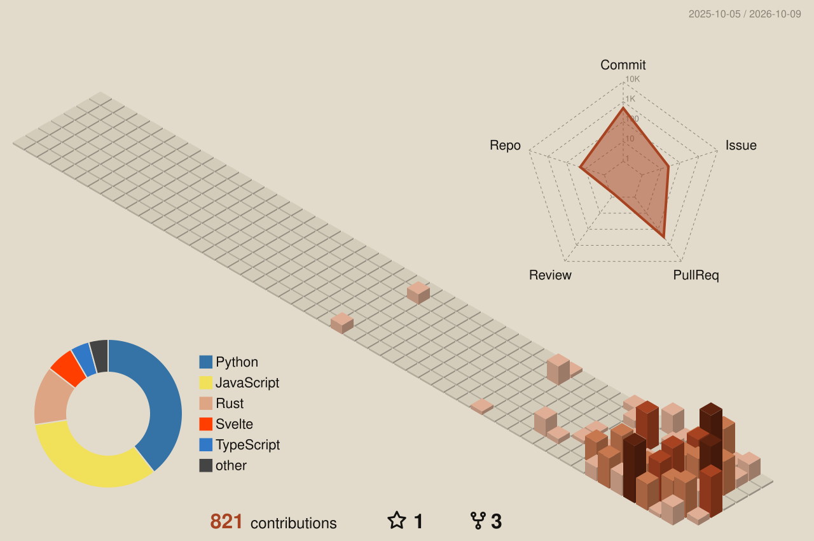
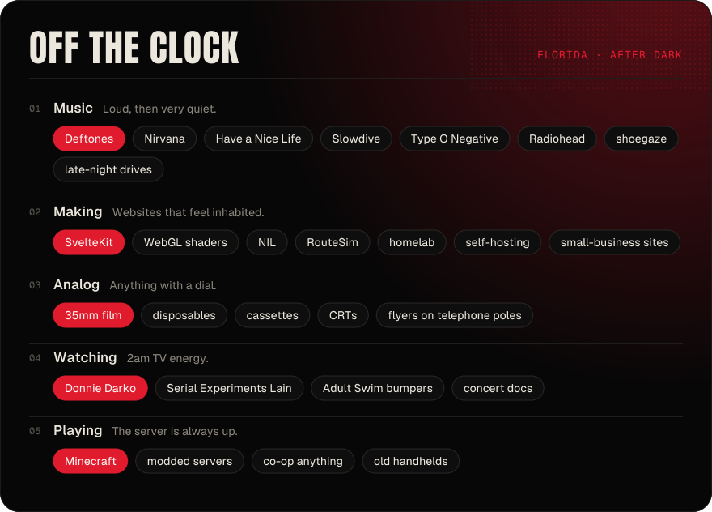

<!--
  github.com/DasVR — profile README, pro edition (matches p.dasdev.net/pro).
  Palette: paper #e2dbcc · graphite #141311 · dim #544f46 · clay #a84321 · line #cfc6b3
  Dynamic parts:
    - profile-3d-contrib/*  and the activity list  → .github/workflows/profile.yml (daily)
    - snake-*.svg on the `output` branch             → same workflow
    - streak / typing / views                        → public image services, live on every load
-->

  

  

  
  
  
  
  

 

I design and build websites for small businesses that don’t look like they came out of a template drawer — fast, hand-styled, and easy to keep running. On the side I build the tools I want to exist: local-first software, self-hosted AI agents, and terminal-first security tooling.

**Florida · remote** &nbsp;·&nbsp; Eastern Time &nbsp;·&nbsp; replies within a day

 

#### `01` &nbsp; Selected work

| Project | About | Type | Status |
|:--|:--|:--|:--|
| **[dasdev.net](https://dasdev.net)** | Portfolio and studio front door. Hand-styled client sites — no themes, no page builders. | Studio | `● Live` |
| **[NIL](https://github.com/DasVR/NIL)** | A terminal-first workstation. Svelte 5, on-device, opinionated about where your data lives. | Product | `◐ Building` |
| **[p.dasdev.net](https://github.com/DasVR/spacehey-personal)** | NFC + QR tap card. WebGL dithering, one-tap vCard, casual and pro modes. | Identity | `● Live` |
| **Hermes** | Self-hosted agent framework — model routing, memory, plugins, Discord front end. | AI | `◐ Building` |
| **RouteSim** | Routing and traffic simulation. Part game, part excuse to write pathfinding. | Side project | `◐ Building` |
| **Homelab** | Self-hosted services, backups, and a Minecraft box that stays up through Florida storms. | Infra | `○ Running` |

 

#### `02` &nbsp; Now

| | |
|:--|:--|
| **Building** | NIL v1 and the p.dasdev.net tap card |
| **Learning** | Algorithmic trading pipelines — data, backtests, paper trading |
| **Running** | Local LLMs on an RTX 3060 box, Hermes agents, the homelab |
| **Listening** | *White Pony* on repeat |

 

#### `03` &nbsp; What I do

`Marketing sites` &nbsp; `Design systems` &nbsp; `Front-end engineering` &nbsp; `Motion & WebGL` &nbsp; `Self-hosting` &nbsp; `AI agents` &nbsp; `Security tooling`

 

#### `04` &nbsp; Tools

  

`SvelteKit` &nbsp; `Svelte 5` &nbsp; `TypeScript` &nbsp; `WebGL` &nbsp; `Node` &nbsp; `Linux` &nbsp; `Docker` &nbsp; `PowerShell` &nbsp; `Ollama` &nbsp; `Cursor`

 

#### `05` &nbsp; Security

I build terminal-first tooling for authorized assessments and lab work — NIL is the workstation that ties it together: keyboard-driven, local-first, and strict about where findings and credentials live.

- **Focus** &nbsp; recon and assessment workflows, automation, and home-lab targets
- **Principles** &nbsp; on-device data, reproducible runs, nothing phones home
- **Responsible use** &nbsp; everything here is for systems you own or are authorized to test. Found a problem in one of my projects? Email [hello@dasdev.net](mailto:hello@dasdev.net) rather than opening a public issue.

 

#### `06` &nbsp; By the numbers

  <picture>
    <source media="(prefers-color-scheme: dark)" srcset="./profile-3d-contrib/profile-dasdev-dark.svg">
    
  </picture>

  

  <picture>
    <source media="(prefers-color-scheme: dark)" srcset="https://raw.githubusercontent.com/DasVR/DasVR/output/snake-dark.svg">
    
  </picture>

 

#### `07` &nbsp; Recent activity

<!--START_SECTION:activity-->
1. 🎉 Merged PR [#112](https://github.com/DasVR/smart-display/pull/112) in [DasVR/smart-display](https://github.com/DasVR/smart-display)
2. 💪 Opened PR [#112](https://github.com/DasVR/smart-display/pull/112) in [DasVR/smart-display](https://github.com/DasVR/smart-display)
3. 🎉 Merged PR [#56](https://github.com/DasVR/dasdevbot/pull/56) in [DasVR/dasdevbot](https://github.com/DasVR/dasdevbot)
4. 🎉 Merged PR [#57](https://github.com/DasVR/dasdevbot/pull/57) in [DasVR/dasdevbot](https://github.com/DasVR/dasdevbot)
5. 🎉 Merged PR [#53](https://github.com/DasVR/dasdevbot/pull/53) in [DasVR/dasdevbot](https://github.com/DasVR/dasdevbot)
6. 💪 Opened PR [#57](https://github.com/DasVR/dasdevbot/pull/57) in [DasVR/dasdevbot](https://github.com/DasVR/dasdevbot)
<!--END_SECTION:activity-->

 

#### `08` &nbsp; Contact card

<table>
  <tr>
    <td valign="top">
       
      <b>This is my tap card.</b> The same card lives on an NFC keychain and a QR code — tap it on a phone and it lands in your contacts in one go.
        
      
       
      
       
      
       
      
       
      
        
      New site, redesign, landing page, online store, or something odd — I reply within a day, Eastern Time.
    </td>
  </tr>
</table>

 

<b>Off the clock</b> &nbsp;the casual card, unfolded on click

 

<table>
  <tr>
    <td valign="top">
       
      Florida humidity on the windows, analog cameras in a drawer, old web in the bookmarks. A room with the lights down and a flyer on the wall.
        
      The loud version of this page lives at <a href="https://p.dasdev.net/"><b>p.dasdev.net</b></a> — Top 8, guestbook, the record crate and a photo roll.
    </td>
  </tr>
</table>

  

##### On the aux &nbsp;·&nbsp; <i>Gig Flyer Vol. 2</i>

| # | Track | Artist | |
|--:|:--|:--|:--|
| `01` | Change (In the House of Flies) | Deftones | [▶︎ listen](https://music.apple.com/us/album/change-in-the-house-of-flies/1537631309?i=1537631475&uo=4) |
| `02` | Heart-Shaped Box | Nirvana | [▶︎ listen](https://music.apple.com/us/album/heart-shaped-box/1440858699?i=1440859107&uo=4) |
| `03` | Be Quiet and Drive (Far Away) | Deftones | [▶︎ listen](https://music.apple.com/us/album/be-quiet-and-drive-far-away/1099843198?i=1099843334&uo=4) |
| `04` | Bullet with Butterfly Wings | The Smashing Pumpkins | [▶︎ listen](https://music.apple.com/us/album/bullet-with-butterfly-wings/1455510683?i=1455510876&uo=4) |
| `05` | Karma Police | Radiohead | [▶︎ listen](https://music.apple.com/us/album/karma-police/1097861387?i=1097861836&uo=4) |
| `06` | Today | The Smashing Pumpkins | [▶︎ listen](https://music.apple.com/us/album/today/721207206?i=721207666&uo=4) |
| `07` | Harness Your Hopes (B-side) | Pavement | [▶︎ listen](https://music.apple.com/us/album/harness-your-hopes-b-side/1589160766?i=1589161038&uo=4) |
| `08` | Serve the Servants | Nirvana | [▶︎ listen](https://music.apple.com/us/album/serve-the-servants/1440858699?i=1440858845&uo=4) |
| `09` | Lake of Fire (Live Acoustic) | Nirvana | [▶︎ listen](https://music.apple.com/us/album/lake-of-fire-live-acoustic/1440892370?i=1440893065&uo=4) |
| `10` | Jigsaw Falling Into Place | Radiohead | [▶︎ listen](https://music.apple.com/us/album/jigsaw-falling-into-place/1109714933?i=1109715469&uo=4) |
| `11` | Say It Ain't So | Weezer | [▶︎ listen](https://music.apple.com/us/album/say-it-aint-so/1440869641?i=1440870181&uo=4) |
| `12` | Beverly Hills | Weezer | [▶︎ listen](https://music.apple.com/us/album/beverly-hills/1440865423?i=1440865427&uo=4) |
| `13` | Mind Eraser, No Chaser | Them Crooked Vultures | [▶︎ listen](https://music.apple.com/us/album/mind-eraser-no-chaser/1237748988?i=1237748994&uo=4) |
| `14` | Knife Prty | Deftones | [▶︎ listen](https://music.apple.com/us/album/knife-prty/1099848709?i=1099848807&uo=4) |

<!-- NOW PLAYING — turn on once you have a Last.fm account scrobbling Apple Music/Spotify:

-->

 

Numbers, calendar and activity refresh daily via GitHub Actions · © Arriq · <a href="https://dasdev.net">DasDev.net</a>

